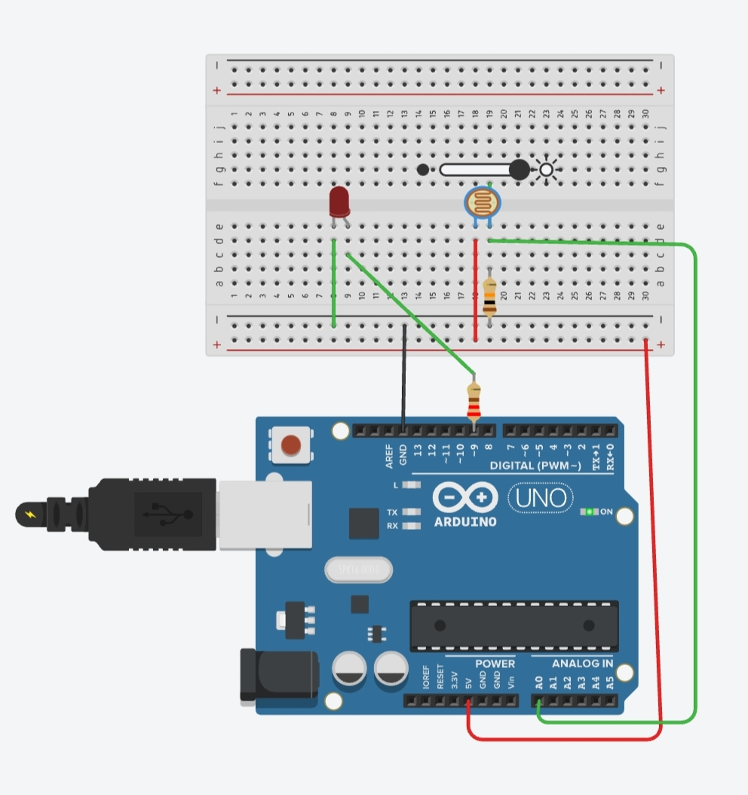
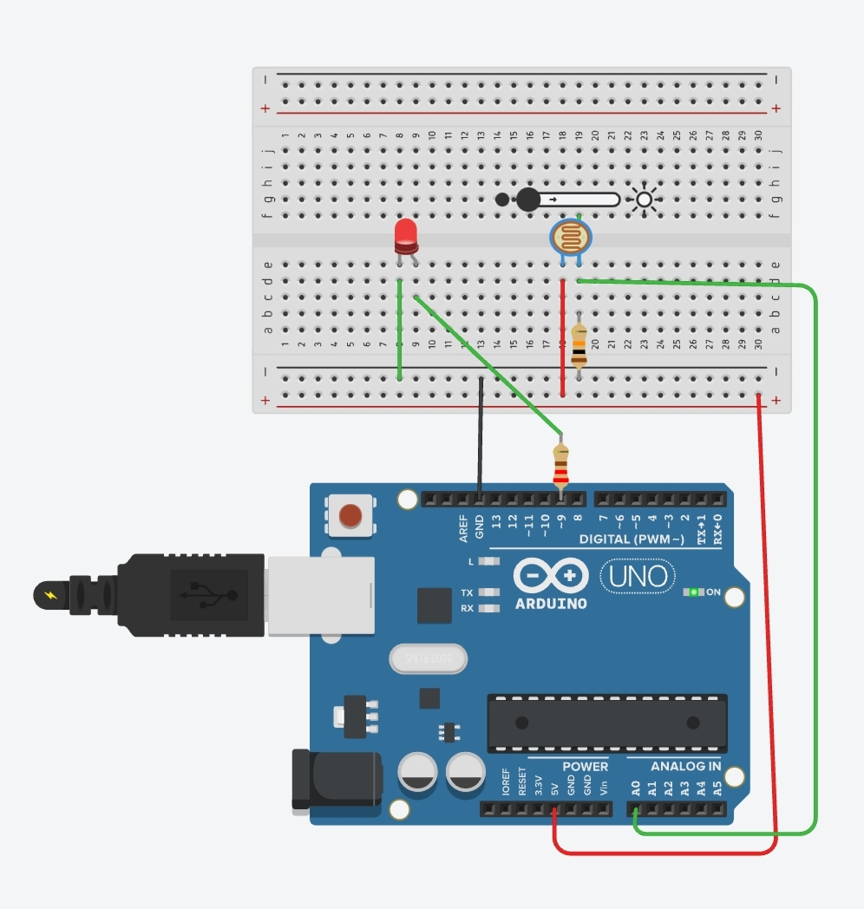

# Arduino Automatic Street Light

An Arduino-based Automatic Street Light system that uses an LDR (Light Dependent Resistor) to detect ambient light and automatically controls an LED. The LED turns ON in low-light conditions and OFF in bright light.

---

# Project Overview

This project demonstrates how an Arduino Uno can be used to automate street lighting based on surrounding light intensity. It is a simple embedded systems project suitable for beginners to learn sensor interfacing and Arduino programming.

---

# Features

- Automatic light detection using an LDR
- LED turns ON in darkness
- LED turns OFF in daylight
- Real-time light value displayed in the Serial Monitor
- Built and tested in Tinkercad

---

# Components Used

- Arduino Uno
- LDR (Light Dependent Resistor)
- LED
- 220Ω Resistor
- Breadboard
- Jumper Wires

---

## Circuit Diagram

---

# Working Principle

1. The Arduino reads the light intensity from the LDR.
2. If the light intensity is below the threshold value, the LED turns ON.
3. If the light intensity is above the threshold value, the LED turns OFF.
4. The LDR value is continuously displayed on the Serial Monitor.

---

# Software Used

- Arduino IDE
- Tinkercad

---

# Project Files

- `Automatic_Street_Light.ino` – Arduino source code

---

# Future Improvements

- Add multiple street lights
- Integrate ESP32 for IoT monitoring
- Display sensor values on an LCD
- Monitor the system through a mobile application

---

# Author

**Charvila Reddy**  
Electronics and Communication Engineering (ECE) Student

---

# License

This project is shared for educational and learning purposes.
